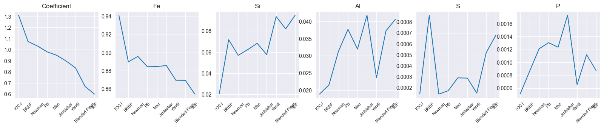
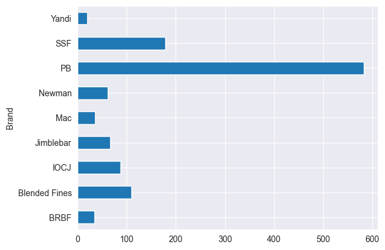

## Metals Data Analysis

* Adapted from take home assignment. 
* Given a dataset of daily dry bulk shipments of iron ore in between various ports in China, asked to perform some EDA and analysis.
* E.g demonstrate the impact of specifications (Fe, Si, Al, S, P) - composition by weight on price and calculate price indices via regression.

 
 

Effect of specification (composition) on price indices of various ores.

 

Proportion of different ores in daily shipments around Chinese ports for 2018.

